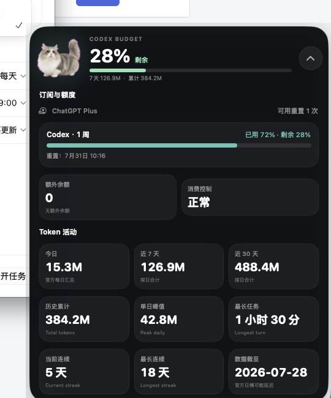

# Duanduan Codex Usage

A tiny open-source macOS companion that gives your Codex desktop pet a live
usage dashboard — and makes Duanduan jump out and knock when only 10% remains.



## What it shows

- A compact midnight capsule with a crisp, high-contrast core and a subtle translucent edge glow
- Every active Codex rate-limit window
- Used and remaining percentage
- Window duration and reset time
- ChatGPT plan, extra balance, spend-control state, and reset credits
- Today, 7-day, 30-day, and lifetime token activity
- Peak daily tokens, longest turn, and usage streaks
- Full daily token history and a compact trend chart

When any active limit reaches **10% remaining or less**, Duanduan:

- jumps and waves a paw like knocking
- shakes the floating panel
- plays a sound
- sends a macOS notification

The automatic warning fires once per reset window. A built-in test button lets
you preview it at any time.

## Requirements

- macOS 13 or newer
- ChatGPT/Codex desktop app installed
- Signed in to Codex with ChatGPT
- Xcode Command Line Tools for building from source

## Install

```bash
git clone https://github.com/dantong0814-a11y/duanduan-codex-usage.git
cd duanduan-codex-usage
./scripts/install.sh
```

The installer builds the app locally, places it at
`~/Applications/Duanduan Usage.app`, and adds a per-user login LaunchAgent.

## Use

- Click Duanduan or the arrow to expand the complete dashboard.
- Use the paw icon in the macOS menu bar to refresh, test the warning, hide the
  panel, or quit.
- Drag the floating panel to move it.
- Data refreshes every 60 seconds.

## Uninstall

```bash
./scripts/uninstall.sh
```

## Build without installing

```bash
./scripts/build.sh
open "build/Duanduan Usage.app" --args --demo --expanded
```

`--demo` uses generated sample data and never reads an account. Add
`--test-alarm` to preview the 10% warning.

## Data accuracy and limitations

The app reads the local Codex app-server methods
`account/rateLimits/read` and `account/usage/read`. It uses the existing local
ChatGPT sign-in and does not store passwords or API keys.

The account endpoint reports total token activity by day and lifetime totals.
It does **not** provide account-level input/output/cached-token splits, so this
project does not estimate or fabricate those values. Daily buckets may also be
reported with a delay.

Codex app-server is experimental, so a future Codex update may require a
protocol adjustment.

See [PRIVACY.md](PRIVACY.md) for the complete privacy statement.

## 中文说明

这是一个 macOS 本机小助手：显示 Codex 订阅额度与 Token 活动；当任一额度
只剩 10% 时，短短会跳出来挥爪敲门、震动面板并发送通知。

安装后不会读取或保存密码、API Key。所有数据都通过本机 Codex 登录状态读取，
没有输入/输出 Token 拆分的字段就不会自行估算。

## License

MIT. The bundled Duanduan sprite frames are included under the same license.

This project is independent and is not affiliated with or endorsed by OpenAI.
